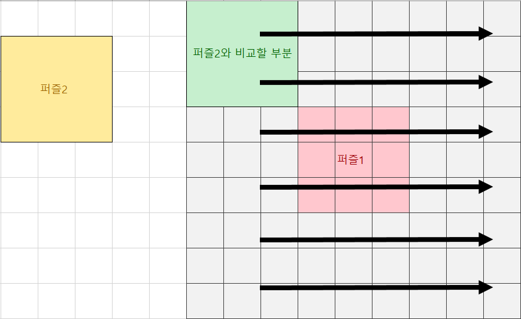

## 1번 (EOF처리 도움 받음)
- 완전탐색으로 문제를 풀었다.
- 테스트 케이스의 개수가 정해지지 않아서 당황했지만, 스터디원한테 EOF처리 도움을 받아서 해결했다.
  - ```
    String s = "";
    while ((s = br.readLine()) != null) {}
    ```
    위와 같은 방법으로 EOF를 처리할 수 있었다.
- boolean 배열로 방문처리를 통해 중복값을 알아냈다.
- 해당 숫자를 10으로 나눈 나머지 값을 방문처리 하면서 답을 구했다.

다른 풀이를 살펴보니 문자열로 값을 입력받고, 문자에 각각 접근해서 방문처리를 하는 방법을 많이 사용했다.
어떤 방법이 더 좋은지 알아보아야겠다.
쉽게 풀 수 있었지만 EOF 처리 때문에 잘 풀리지 않았다.
까먹지않고 꼭 알아두도록 하자.

## 2번 (문제 이해 실수)
- 시작하는 블럭의 높이가 1이상 1000이하이므로, 1부터 증가시켜가면서 바꿔야하는 블럭의 수를 찾았다.
- 각 블럭은 K크기 간격으로 일정하게 증가하는 형태이어야 한다.
- 블럭 배열을 순회하면서 인덱스와 K값을 활용해, 갖추어야하는 블럭 높이를 구했다.
- 변경이 필요한 블럭이라면 count를 증가시켰고, 가능한 count중에서 최소값을 도출했다.

문제에서 인접 블럭은 K간격만큼 차이가 난다고하여, 증가와 감소가 번갈아가면서 나타날 수 있다고 접근했다.
그래서 초반에는 가능한 경우의 수를 나누어 BFS로 답을 찾았었다.
하지만 문제에서 주어진 점화식을 보면, 다음 인덱스의 블럭은 무조건 이전 블럭보다 높아야 한다는 것을 알 수 있었다.
문제가 헷갈리게 알려준 부분도 있지만 문제를 꼼꼼하게 봐야할 필요성을 느꼈다.
매우 아쉬웠기 때문에 다음부터는 이런 실수가 없도록 해야겠다.

## 3번
- 큐를 사용한 BFS로 해결했다.
- 이 문제에서는 양과 늑대가 울타리안에 갇혀있기 때문에, 배열 밖을 탐색하는 경우는 고려할 필요가 없다.
- 차례대로 배열을 순회하며 양이나 늑대가 나오면 BFS를 시작했다.
- 방문처리는 boolean배열로 했다.
- 4방탐색하면서 .을 만나면 그대로 큐에 넣었고, 늑대나 양이 나오면 각 동물의 개수 증가 후 큐에 넣었다.
- 각 울타리 안에서 동물별 개수에 따라 살아남는 동물의 개수를 더해주었다.

이 문제를 풀면서 고민했던 부분은 4방탐색을 했을 때 경우의 수를 어떻게 나눌지 고민을 했다.
좌표값을 어떻게 큐에 넣을까 고민하다가 Node클래스를 만들어서 해결했다.
아직 BFS문제에 익숙하지않아서 시간이 오래걸렸다.
자주 나오는 유형이므로 많이 풀어보면서 익숙해져야겠다.

## 4번 (완전탐색 방법 찾아봄)
- 완전 탐색으로 가능한 퍼즐 배치 중 액자 크기의 최소값을 구함.
- 각 퍼즐의 최대 크기는 50x50이므로 액자 배열을 150x150 크기로 설정. 인덱스를 1부터 시작하기 위해 크기를 1씩 더 주었다.
- 퍼즐1을 액자 배열 중앙 (51, 51) 위치에 고정한다.
- 퍼즐의 왼쪽 위 좌표를 기준으로, 시작위치를 액자 배열의 (1, 1) ~ (101, 101)로 이동시켜가며 탐색한다.
- 시작 위치로부터 50x50 면적을 탐색하며 퍼즐2와 겹치는지 확인하고, 겹치지 않는다면 액자 크기를 계산한다.
- 탐색이 끝나면, 퍼즐2를 90도씩 회전해보며 다시 탐색한다.
- 액자 크기를 계산할 때 마다 최소값을 갱신하여 답을 구한다.

퍼즐1을 고정시켜놓고 퍼즐2를 회전시켜가며 순차적으로 탐색하는 아이디어는 떠올렸으나, 탐색과정을 어떻게 구현할지 막막했다.
겹치는 부분만 계산해보는 등 여러가지 시도를 했으나 제대로 동작하지 않았다.
검색을 통해서 최대 액자크기를 150x150으로 하는 2차원배열을 만들어서 탐색하는 방법을 찾았다.
퍼즐의 최대크기는 50x50을 넘지 않으므로 인덱스 밖으로 벗어날 경우를 생각할 필요가 없었다.



퍼즐2를 액자배열에 삽입해보며 비교하는 것이 아니라, 위 그림과 같이 만들어진 액자배열에 퍼즐2가 들어갈 부분과 실제 퍼즐2의 값을 비교하는 방식으로 했다.
이렇게 하면 액자배열에 퍼즐2를 삽입 후 다시 원상복귀하는 과정은 필요없어지게 된다.
좌표값을 이동시키며 탐색하는 과정이 너무 어려웠고, 오랫동안 붙잡고 생각하며 수정했다.
그리고 퍼즐2를 회전시키는 과정도 어려웠다.
50x50크기 그대로 회전시키면 퍼즐의 기준점이 (1, 1)이 아니어서 많이 실패했다.
실제퍼즐의 가로길이와 세로길이를 바꾸어가며 기준점을 (1, 1)로 유지한 채 회전시키는 것이 어려웠다.
공간적 사고능력이 부족하다고 생각했고, 그림을 그려가며 차근차근 연습해야겠다.
배열끼리의 좌표탐색과 배열회전구현 방법을 많이 연습해서 익숙해져야겠다.
이와 비슷한 구현문제를 많이 풀어봐야겠다.
