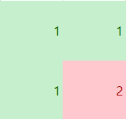
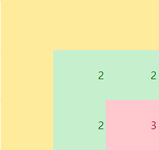

## 1번
- 정렬을 사용한 쉬운 문제.
- 배열을 정렬한 후, 먹을 수 없을 때 까지 먹이를 먹고 길이를 출력한다.
- 먹이를 먹을 때 마다 길이를 1씩 증가시켰다.

이 문제는 엄청 빨리 풀었다.
처음에는 먹이를 순서대로 지나치면서 먹을 수 있는 것만 먹는 조건인줄 알았다.
하지만 지나친 먹이도 길이가 늘어나면 다시 먹을 수 있었고, 정렬을 통해 해결했다.
문제를 꼼꼼하게 보자.

## 2번
- 간단한 BFS로 풀었다.
- 친구의 친구까지만 결혼식에 부를 수 있어서, 깊이 탐색할 필요가 없었다.
- 인접 리스트로 친구관계를 저장하고 visited 배열로 방문표시를 했다.
- 주인공과 친구인 사람들을 모두 큐에 삽입하고 개수를 더한다.
- 그리고 큐에서 값을 빼면서 그 사람과 친구인 사람들 모두 값을 더해줬고, 큐에는 다시 넣지 않았다.

인접리스트를 사용해서 친구관계를 나타내었는데, 다음에는 이중리스트로도 구현해보아야겠다.
생각보다 간단하게 풀었다.

## 3번 (DP 아이디어 도움 받음)
- 완전탐색으로 구현했으나 시간초과로 1차 실패했었다.
- DP를 사용해서 해결했다.
- array 배열을 입력받고 DP배열을 같은크기로 하나 더 만들었다.
- DP배열의 1행과 1열에는 array값이 0이면 1, 0이 아니면 0으로 초기화했다.
- 남은 DP배열을 차례대로 순회하면서 기준칸의 위, 왼쪽, 왼쪽위 방향의 값 중 최소값으로 갱신해 나갔다.
- 갱신하는 값 중 가장 큰 값이 만들 수 있는 가장 큰 정사각형이다.

갱신하는 DP칸은 정사각형의 오른쪽 아래 모서리 칸을 의미한다.
그 기준 칸에서 위, 왼쪽, 왼쪽위 방향의 칸의 값의 최소값이 1이라면, 기준 칸까지의 정사각형 크기는 2임이 보장된다.
마찬가지로 기준 칸에서 탐색한 칸의 최소값이 2라면, 기준 칸 까지의 정사각형 크기는 3임이 보장된다.
이를 계속 반복하여 정사각형의 최대 크기를 구했다.
문제를 풀 때 DP를 사용할 생각을 전혀 못했다.
오른쪽 아래칸을 기준칸으로 사용한 아이디어가 좋았던거 같다.
DP문제는 정말 어려운거 같다.
다양한 사고를 통해 문제 해결능력을 키워야겠다.

## 4번
- BFS로 풀었다.
- 주의할 점으로는, 무지개블럭은 다른 그룹에서 다시 재사용할 수 있어야하기 때문에 방문표시를 해주면 안된다.
- 그렇게 BFS를 돌면 무한루프에 빠지므로, BFS에 사용할 방문배열을 따로 만들어서 해결했다.
- 그룹을 탐색할 때 위에서 차례대로 탐색하므로, 블럭크기와 무지개블럭 개수가 같다면 무조건 나중에 탐색한 기준블럭의 x, y 좌표가 클 수 밖에 없다.
- 최대 그룹의 블럭을 빈 공간으로 바꾸기 위해 기준 블럭을 시작으로 BFS를 한번 더 실행하여, -2를 삽입해 빈 공간을 표시했다.
- 블럭을 아래에서 부터 순차적으로 탐색하여 블럭아래에 빈 공간이 있으면 1행씩 반복하여 이동시켰다.
- 아래에서 부터 탐색하지 않으면 중간에 빈 공간이 생기기 마련이다.
- 격자의 가로세로 길이가 같으므로 길이 변경 없이 90도 회전시킨 배열을 만든다.
- 다시 중력 작용을 반복하다가, 블럭크기가 2보다 작아지면 답을 출력하고 종료했다.

구현 양이 상당히 많았고, 고려해야할 조건이 많아서 까다로웠다.
무지개 블럭은 재사용할 수 있어야 한다는 점과, 그래서 방문배열을 따로 하나 만들어야 했다는 점, 중력 작용시 아래블럭부터 작용해야한다는 점 등 이러한 이유로 여러번 실패했다.
문제를 꼼꼼하게 보고 놓치는 조건이 없는지 천천히 살펴보는게 중요한 거 같다.
배열 간 탐색과 회전, 이동 등의 구현에 익숙해지자.
