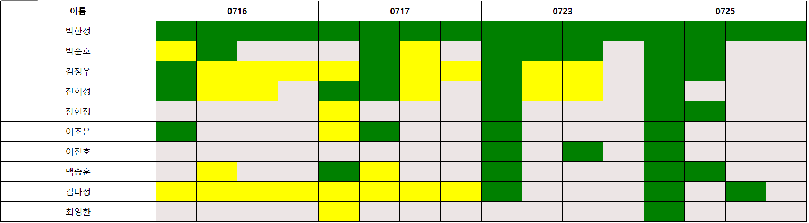

# SSAFY 12th 알고리즘 스터디

## 스터디 정보

일시 : 매주 화/목 오후 9시 ~ 11시

문제 : 백준 실버 4 ~ 골드 1 중 4문제

시간 : 1시간 30분 라이브 코딩, 30분 풀이 및 발표

## 스터디원

### SSAFY

0. 이름_학번 (백준아이디)
1. 박한성_1255261 (phs7646)
2. 박준호_1252048 (wnsgh712)
3. 김정우_1259314 (3957ki)
4. 전희성_1254441 (gmltjd8002)
5. 장현정_1256074 (hyunddoing)
6. 이조은_
7. 이진호_
8. 백승훈_
9. 김다정_

### Non SSAFY

0. 이름 (백준아이디)
1. soyoung (jeong52)

## 스터디 규칙

1. 3회 이상 연속 불참 시 제외
2. 라이브 코딩시 화면공유 on (감시 목적)
3. 라이브 코딩시 레퍼런스 페이지 제외 검색 금지
4. 백준 태그 열람 금지

